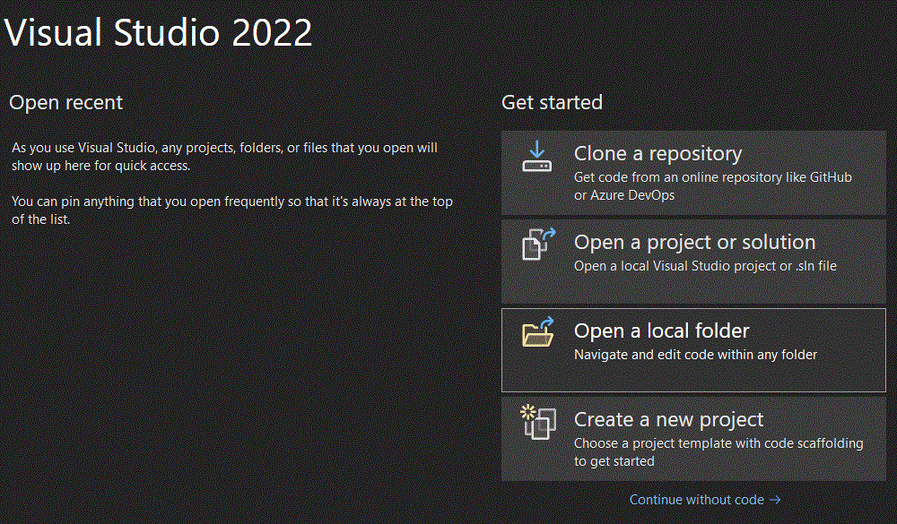

# Quiz System Made in CMD (with colors!)

## How to run
**Program requires c++23**

### Clion:
Create a new project in src using existing source.

### Visual Studio 2022
#### Open folder in visual studio: 

#### Select "src" folder: 

### Ensure target is set to "src.exe"

## Demo
### 

This project follows [Google C++ Style Guide](https://google.github.io/styleguide/cppguide.html).
